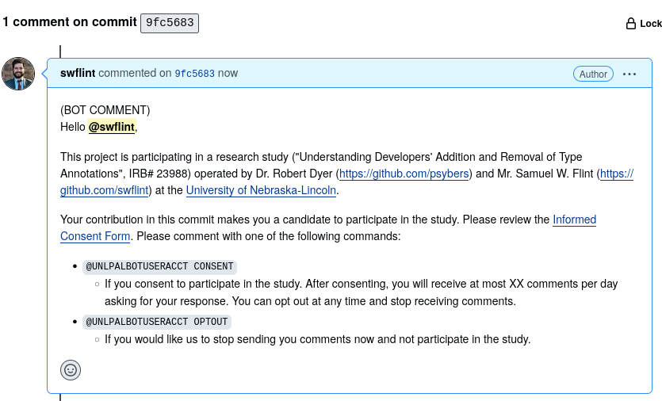
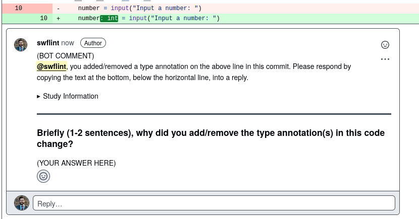
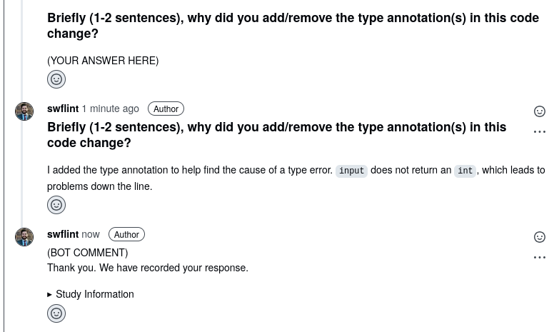

At any time during the monitoring period, a person may submit an opt out command as a commit comment on a commit in any monitored project (at which point the [Participant Opts Out](#opts-out) flow is followed).
They may likewise request removal of their data (and the [Participant Requests Removal Of Data](#removal-requested) flow is followed).

#### Note on Conventions and Assumptions {-}

In this document, comments made by our bot are marked with `(BOT COMMENT)` for clarity.
Upon deployment, these comments will not include this phrase, as GitHub marks bot actions automatically.

Additionally, we assume that we are dealing with projects which have agreed to participate in this project.

Finally, some small details (exact location of study website, the name of the bot) have not yet been determined.
In particular, in this document, the bot referred to as `@UNLPALBOTACCT` will be given a slightly different name.

# Start {#start}

A commit which adds or removes a type annotation has been detected (see [Figure 1](#fig:commit-detected)).

{#fig:commit-detected}

 - If the committer is on the opt-out list, do nothing.
 - If the committer is not listed, go to [Participant Not Listed](#not-listed)
 - If the committer has consented, go to [Send Survey](#send-survey)
 - If the committer is listed as having been contacted, but has not consented, STOP.

# Participant Not Listed {#not-listed}

Otherwise, place committer on list of contacted committers and send request for consent message (see [Figure 2](#fig:request-consent)).

{#fig:request-consent}

 - If the committer ignores the message, do nothing.
 - If the committer responds with `@UNLPALBOTACCT CONSENT` (see [Figure 3](#fig:consented)), record consent information, and go to [Send Survey](#send-survey).
 - If the committer responds with `@UNLPALBOTACCT OPTOUT` (see [Figure 4](#fig:optout)) go to [Participant Opts Out](#opts-out)
 
{#fig:consented}

{#fig:optout}

# Send Survey {#send-survey}

Committer is not on opt-out list, and has consented to participate in the study.

If this is the first a participant is surveyed, we will send a one-question general survey, as shown in [Figure 5](#fig:general-survey).

{#fig:general-survey}

Based on the last time the participant was asked to respond, we will send a short survey, ensuring that participants are not contacted more than one time a 24-hour period (see [Figure 6](#fig:survey)).
The survey will be submitted on the line which introduces the type change.

{#fig:survey}

 - If the participant responds to the survey, record the response, and show an acknowledgment (see [Figure 7](#fig:survey-response)).
 - If the participant submits `@UNLPALBOTACCT OPTOUT` (see [Figure 8](#fig:optout)), go to [Participant Opts Out](#opts-out)
 - If the participant submits `@UNLPALBOTACCT REMOVE` (see [Figure 9](#fig:removal-request)), go to [Participant Requests Removal of Data](#removal-requested)
 
{#fig:survey-response}
 
{#fig:removal-request}

# Participant Opts Out {#opts-out}

The participant/committer is placed on the opt-out list, and sent an acknowledgment (see [Figure 10](#fig:opt-out-removal-ack)).

{#fig:opt-out-removal-ack}

# Participant Requests Removal Of Data {#removal-requested}

A participant has submitted the command `@UNLPALBOTACCT REMOVE`.
A record of the removal request, and opt-out is made.
Data other than removal request, opt-out, and initial consent is removed from the server.
We then send an acknowledgment of the request (see [Figure 10](#fig:opt-out-removal-ack)).
